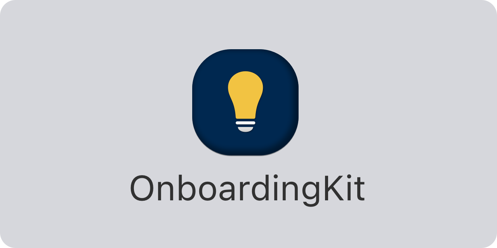

<p align="center">
    
</p>

<p align="center">
    
    
    
        <a href="https://twitter.com/danielsaidi">
        
    </a>
    <a href="https://mastodon.social/@danielsaidi">
        
    </a>
</p>


## About OnboardingKit

OnboardingKit helps you create onboarding expericences like hints and tutorials in `Swift` and `SwiftUI`. 

The result can look like this, or completely different:

<p align="center">
    
</p>

OnboardingKit has different onboarding types. A standard onboarding is shown right away and only once, while other types can require multiple presentation attempts, a certain number of "incorrect" actions, etc. You can also combine different onboarding types to create new ones and reset the state of any onboarding to display it again. 

OnboardingKit supports multiple users, so that each onboarding is unique to each user.

OnboardingKit supports `iOS 13`, `macOS 10.15`, `tvOS 13` and `watchOS 6`.


## Installation

OnboardingKit can be installed with the Swift Package Manager:

```
https://github.com/danielsaidi/OnboardingKit.git
```

If you prefer to no have external dependencies, you can also just copy the source code into your app.


## Getting started

The [online documentation][Documentation] has a [getting started guide][Getting-Started] guide to help you get started with OnboardingKit.

In OnboardingKit, an ``Onboarding`` is at the core of the onboarding experience and determines if a hint or tutorial should be presented. A `Hint` is a short onboarding message that is intended to be displayed briefly while a `Tutorial` is a page-based onboarding flow.

To create a standard onboarding and use it to present a hint or a tutorial, you can do this:

```swift
let onboarding = Onboarding(id: "welcome")
onboarding.tryPresent { 
    let hint = Hint(title: "Welcome!", text: "Welcome to this app.")
    // Present the hint, for instance in a toast or a callout
}
```

For more information, please see the [online documentation][Documentation] and [getting started guide][Getting-Started].


## Documentation

The [online documentation][Documentation] contains more information, code examples, etc., and makes it easy to overview the various parts of the library. 


## Demo Application

The demo app lets you explore the library on iOS and macOS. To try it out, just open and run the `Demo` project.


## Support this library

I manage my various open-source projects in my free time and am really thankful for any help I can get from the community. 

You can sponsor this project on [GitHub Sponsors][Sponsors] or get in touch for paid support.


## Contact

Feel free to reach out if you have questions or if you want to contribute in any way:

* Website: [danielsaidi.com][Website]
* Mastodon: [@danielsaidi@mastodon.social][Mastodon]
* Twitter: [@danielsaidi][Twitter]
* E-mail: [daniel.saidi@gmail.com][Email]


## License

OnboardingKit is available under the MIT license. See the [LICENSE][License] file for more info.


[Email]: mailto:daniel.saidi@gmail.com
[Website]: https://www.danielsaidi.com
[Twitter]: https://www.twitter.com/danielsaidi
[Mastodon]: https://mastodon.social/@danielsaidi
[Sponsors]: https://github.com/sponsors/danielsaidi

[Documentation]: https://danielsaidi.github.io/OnboardingKit/documentation/onboardingKit/
[Getting-Started]: https://danielsaidi.github.io/OnboardingKit/documentation/onboardingKit/getting-started
[License]: https://github.com/danielsaidi/OnboardingKit/blob/master/LICENSE
