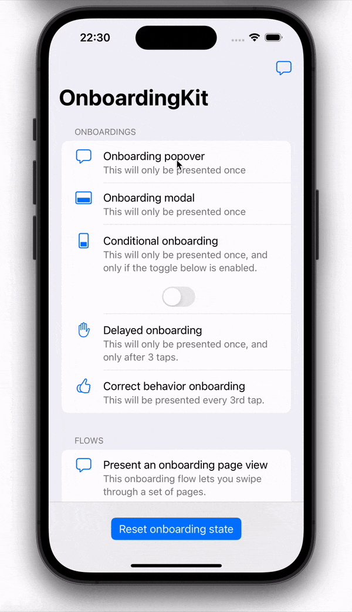

<p align="center">
    
</p>

<p align="center">
    <a href="https://github.com/danielsaidi/Tutti">
        
    </a>
    
    
    
    <a href="https://twitter.com/danielsaidi">
        
    </a>
</p>


## About Tutti

Tutti is a Swift library that can be used to create user onboarding expericences, like quick hints and single- or multi-screen tutorials.

<p align="center">
    
</p>

Tutti only displays a hint/tutorial once by default. This means that even if you tell it to show a tutorial/hint every time an app starts, it will only be shown once. You can reset the display state of a hint/tutorial if you want to display it multiple times.

Tutti also supports user-specific hints/tutorials. Just set the `userId` parameter to the current user's id/name, and Tutti will display the hint/tutorial for every new user.


## Install

### <a name="spm"></a>Swift Package Manager

In Xcode 11 and later, the easiest way to add Tutti to your project is to use Swift Package Manager:
```
.package(url: "git@github.com:danielsaidi/Tutti.git" ...)
```

### CocoaPods

Add this to your `Podfile` and run `pod install`:
```ruby
pod 'Tutti'
```
After that, remember to use the generated workspace instead of the project file.

### Carthage

Add this to your `Cartfile` and run `carthage update`:
```
github "danielsaidi/Tutti"
```
After that, check the Carthage docs for info on how to add the library to your app.

### Manual

To add `Tutti` to your app without a dependency manager, clone this repository and place it somewhere on disk, then add `Tutti.xcodeproj` to the project and `Tutti.framework` as an embedded app binary and target dependency.


## Demo App

This repository contains a demo app. To try it out, open and run the `Tutti` project. The demo app lets you try different types of hints and tutorials.


## Hints

Tutti comes with a set of built-in hint types that can be used for different purposes. 

* `StandardHint` - This is a basic hint with no specific behavior.
* `DeferredHint` - This type requires a certain number of presentation attempts before it is actually presented.
* `CorrectBehaviorHint` - This type can be used to show a hint when the user is behaving "incorrectly".

You can also create your own custom hint types by implementing the `Hint` protocol.


### Creating a hint

This is the most basic way to create a hint with Tutti:

```swift
func createHint(for userId: String?) -> Hint {
    return StandardHint(
        identifier: "hint", 
        title: "This is a hint!", 
        text: "This hint will only be displayed once.", 
        userId: userId)
}
```

In a large app, you may want to use localized strings and have a more sophisticated setup. Check out the example app for more examples.


### Presenting a hint

In Tutti, hints are just data carriers. They don't know anything about how they are to be presented. To present a hint, you'll use a `hint presenter`, for instance:

```swift
self.presenter = CalloutHintPresenter()     // You must keep a strong reference!
presenter.present(hint: hint, in: self, from: view)
```

This will only have an effect if the hint can actually be presented. This means that you don't have to keep track of if a certain hint has been presented or not. Tutti handles this for you.


### Hint presenters

Tutti comes with a couple of built-in hint presenters:

* `AlertHintPresenter` - This presenter presents hints in a regular `UIAlertController`. You should probably not use it in production apps, since it's not a good experience.
* `CalloutHintPresenter` - This presenter is a copy of `EasyTipView` and presents hints in a callout bubble that can point at any view. You can style these callouts to great extent. Have a look [this styling guide](Appearance) and replace `EasyTipView` with `CalloutView`.

You can also create your own custom presented by implementing the `HintPresenter` protocol.


## Tutorials

Tutti comes with a set of built-in tutorial types that can be used for different purposes. 

* `StandardTutorial` - This is a basic tutorial with no specific behavior.
* `DeferredTutorial` - This type requires a certain number of presentation attempts before it is actually presented.
* `CorrectBehaviorTutorial` - This type can be used to show a tutorial when the user behaves "incorrectly".

You can also create your own custom tutorial types by implementing the `Tutorial` protocol.


### Creating a tutorial

This is the most basic way to create a standard tutorial with Tutti:

```swift
func createTutorial(for userId: String?) -> Tutorial {
    return StandardTutorial(
        identifier: "standard", 
        pageCount: 2,
        userId: userId)
}
```

You can then use the tutorial's `resourceName(for key: String, at pageIndex: Int)` function to get a suggested name for any kind of resource at any page. 

For instance, adding the following localized strings to your app would provide a title and a text for two pages in a tutorial with the id `standard`:

```swift
/* 

In Localizable.strings, add this to support the standard tutorial:
    "tutorial_standard_0_title" = "Page 1 title";
    "tutorial_standard_0_text" = "Page 1 text";
    "tutorial_standard_1_title" = "Page 2 title";
    "tutorial_standard_1_text" = "Page 2 text";

*/
```

You can also use the `fromLocalizationWithPageIndicationKey` initializer to automatically resolve the correct number of pages. For instance, using `title` as indication key would resolve two pages for the strings above.


### Presenting a tutorial

In Tutti, tutorials are also just data carriers. They don't know anything about how they are to be presented. To present a tutorial, you'll use a `tutorial presenter`, for instance:

```swift
self.presenter = TutorialViewController(nibName: nil, bundle: nil)   // You must keep a strong reference!
presenter.present(tutorial: tutorial, in: self, from: view)
```

This will only have an effect if the tutorial can actually be presented. This means that you don't have to keep track of if a certain tutorial has been presented or not. Tutti handles this for you.


### Hint presenters

Tutti only comes with a single built-in tutorial presenter: `TutorialViewController`.

This presenter presents tutorials in a modal view controller that takes over the entire screen. To use it, just add a `TutorialViewController.xib` and a `TutorialViewControllerCell.xib` file to your app, then connect your subviews to any outlets provided by `TutorialViewController`. You can also subclass `TutorialViewController` and add as many outlets and triggers as you want.

Creating your own xibs require a bit of work, but you can always copy the xibs from the example app and configure them to look the way you want them to look. I don't want to add them to the library, since they are pretty rough and would not provide a nice user experience.


## Contact me

I hope you like this library. Feel free to reach out if you have questions or if you want to contribute in any way:

* E-mail: [daniel.saidi@gmail.com](mailto:daniel.saidi@gmail.com)
* Twitter: [@danielsaidi](http://www.twitter.com/danielsaidi)
* Web site: [danielsaidi.com](http://www.danielsaidi.com)


## License

Tutti is available under the MIT license. See LICENSE file for more info.


[Carthage]: https://github.com/Carthage/Carthage
[CocoaPods]: https://cocoapods.org/

[Appearance]: https://github.com/teodorpatras/EasyTipView/#-customising-the-appearance-
